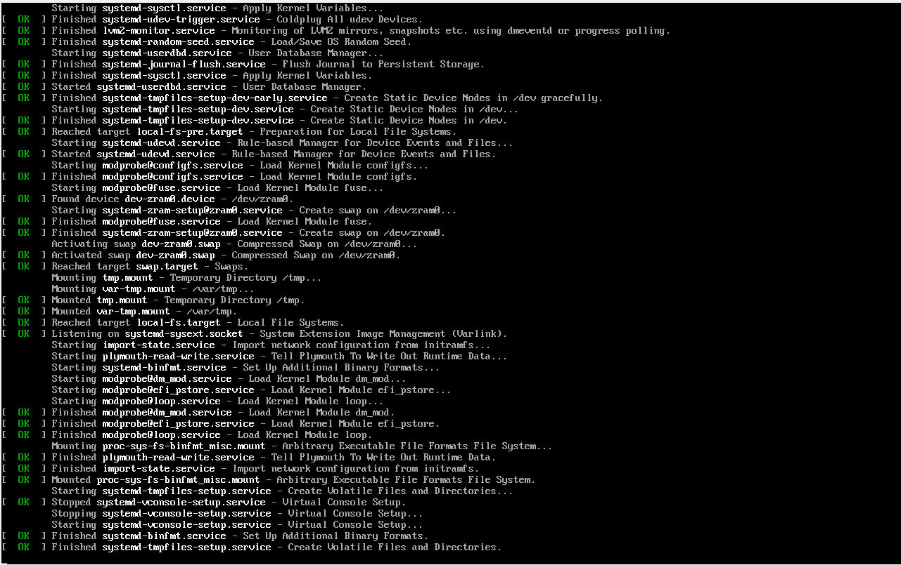
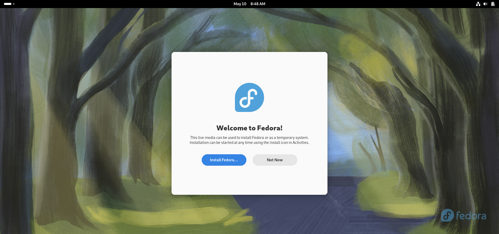
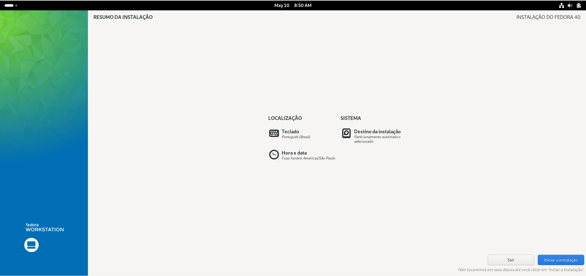
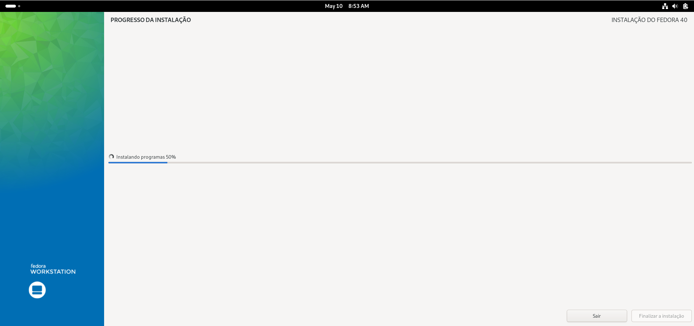
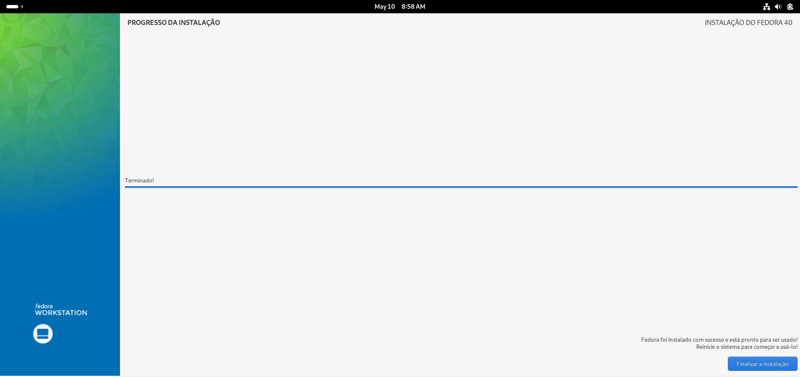

# Passo a Passo para a Instalação da Distribuição Linux: *Fedora* #

## Passo 1 ##
Selecione o sistema a ser instalado (iso) na máquina (Fedora) e aguarde a iniciação.

## Passo 2 ##
Selecione a opção para realizar a instalação do sistema.

## Passo 3 ##
Selecione a língua a ser utilizada no sistema operacional.

## Passo 4 ##
Confirme se a língua e o teclado estão corretos e selecione o local da instalação.

## Passo 5 ##
Após confirmar os itens anteriores, aguarde o carregamento da barra.

## Passo 6 ##
Após a barra carregar por completo, clique no botão "Finalizar a Instalação" no canto inferior direito da tela.

## Tudo Pronto ##
Se os itens anteriores foram concluídos com sucesso, você já pode usar o Fedora como seu sistema operacional.

